```{r setup, include=FALSE}
knitr::opts_chunk$set(echo = TRUE)
library(kableExtra)
```

# Reading
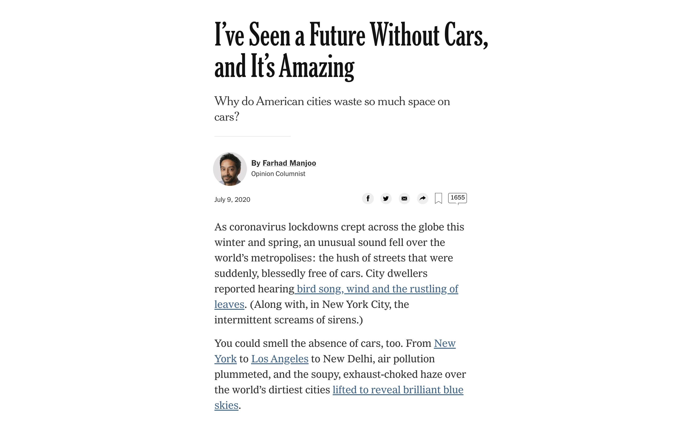


#


## Seoul, Korea
- Korean War (1950)
- Massive growth, urbanization
- Population: 10M (20% of S.Korea's population)
- Wider metropolitan area: 25M (48% of S.Korea's population)

##

[Short Video on Seoul's growth and Public Transportation](https://youtu.be/IE8g82kjKFk?t=655)

## Public Transportation in Seoul
- 2004 BRT (Bus Rapid Transit) reform
	- bus route redesigns and bus lane expansions
	- frequent network of priority bus lines
	- seamless, free transfers between bus and subway

## Result

- Bus Ridership increased by 14% (2004), and 20% (2010)
- Bus speeds doubled
- Faster travel times for cars

## More Space for People
- overpaths and elevated freeways gone
- more walk paths and nature


## Cheonggyecheon
- historic stretth of a natural stream in the heart of the city
- markets, industrial areas, shopping malls, city hall
- elevated freeway built over a stream
- restored in 2005, uncovering nature

## Cheonggyecheon
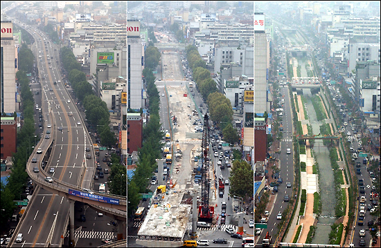

## Benefits
- less traffic congestion
- less air polution
- lower temperature in nearby areas during summer
- "car-oriented city to a human-oriented city"
- restoring the nature
  - number of fish species 4 -> 25
  - bird species 6 -> 36
  - insect species 15 -> 192

## 

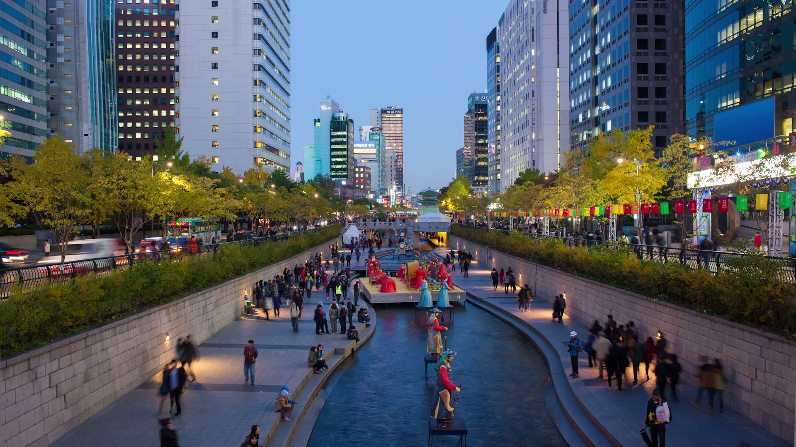

## Seoul-ro
- elevated highway near Seoul Station
- built in 1970 to accomodate growing traffic congestion in Seoul
- Project 7017
  - turn a highway into a pedestrian walkway
  - become a people-friendly city
  - boost in local economy (connectivity and access to small shops)

##

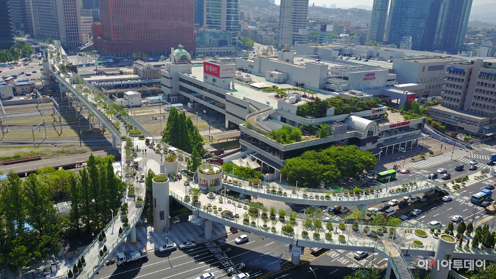

## 

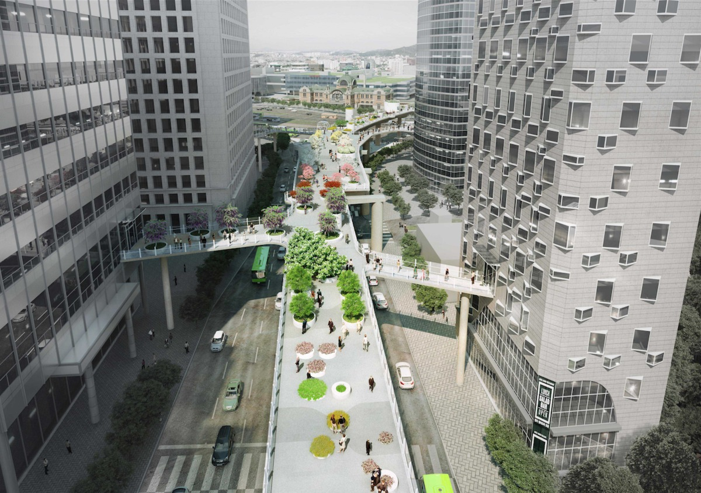

# Columbus, OH

+ 42 bus lines
+ serving 1.2M residents around Columbus
+ more than 19M passengers annually 

## Income
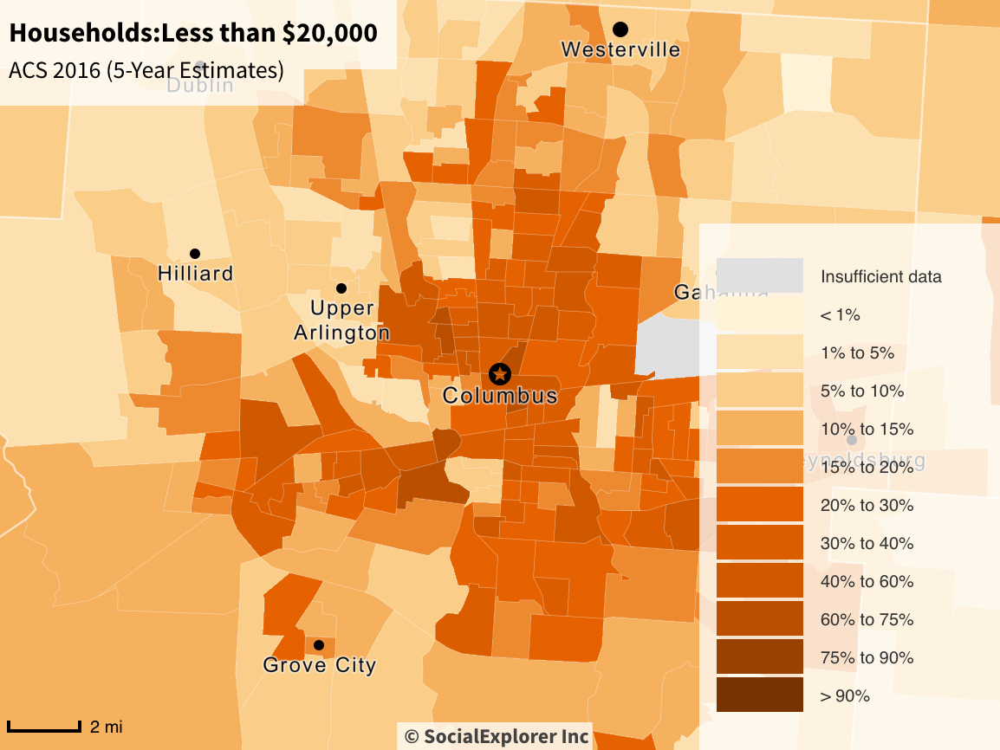

## Race
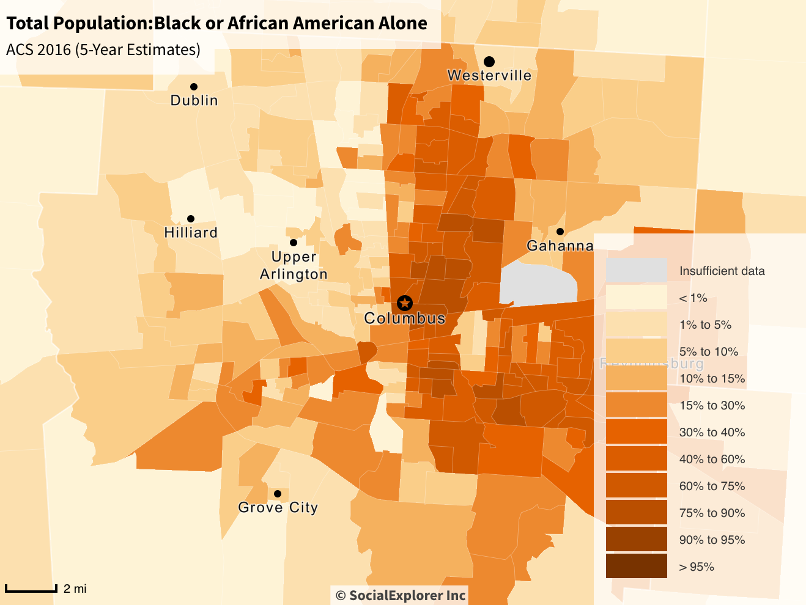

## Research Questions

**What is the relationship between the bus network and spatial inequality in Columbus?**

  + Income levels
  + Food deserts

## Food Desert (Low access to healty food)

+ areas in which people have limited access to healty food
+ gas stations, doller stores (x)
+ groceries (o)
+ parks and recreational facilities
+ financial institutions

## Tract
+ State > County > Tract
+ geographic region around about 4000 people

##

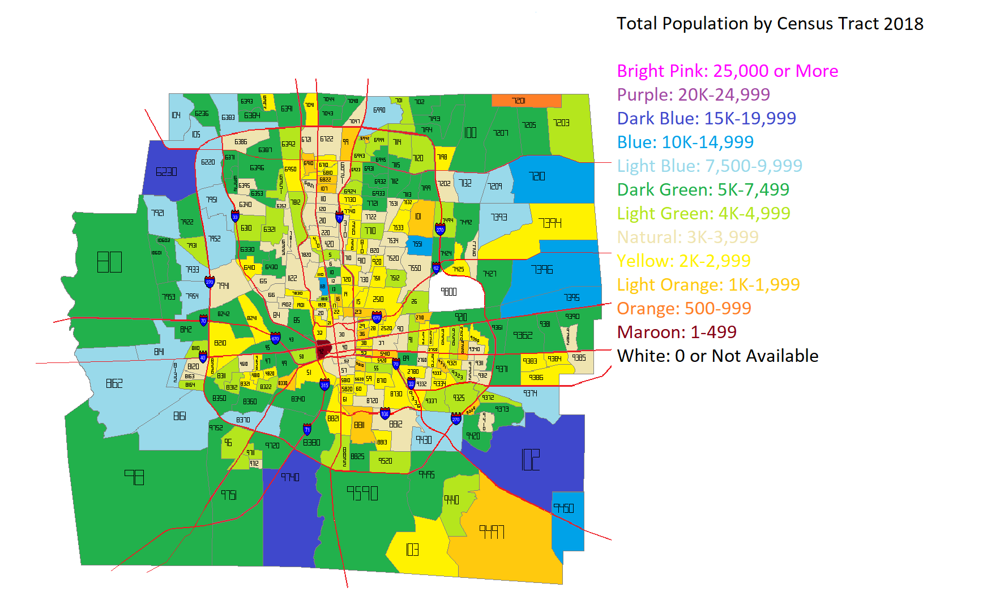

# Data & Methods
## Bus Stop Data
Source: [Smart Columbus Data](https://smartcolumbusos.com)

COTA Bus stop data (Sept. 2018)

+ geocodes
+ bus lines passing through the stop

## Create Network

1. Arrange the stops by each lines
2. Connect the stops (*nodes*) in each lines (forming *ties*)
3. Calculate *Centrality*

## **Centrality**

  + Measuring the importance of a node
  + Having the most ties to other actors in the network
  + More access to other parts of the city

##

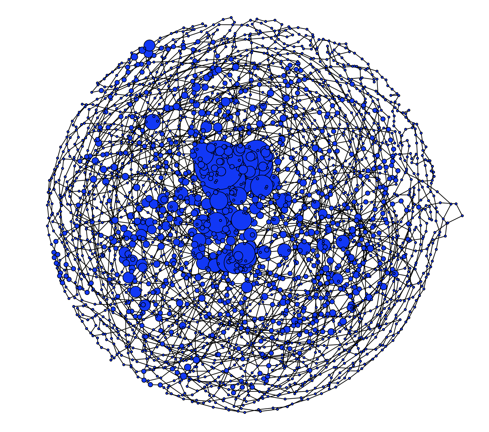

##
```{r, echo=FALSE}
knitr::include_url("https://www.eungangchoi.com/posts/mymap_color.html")
```

## Food Access Research Atlas Data

Source: [USDA](https://www.ers.usda.gov/data-products/food-access-research-atlas/)

+ tract-level data on
  + food access (supermarket accessibility)
  + Low income population
  + low vehicle access
  + by various demographic groups (race, age)


# Results

## Income

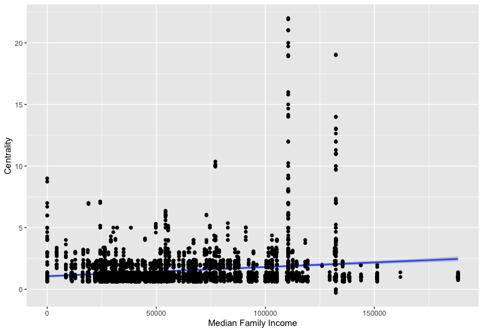

## High Centrality vs. Low Centrality (Median Income)

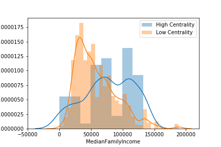

## Low Access Population

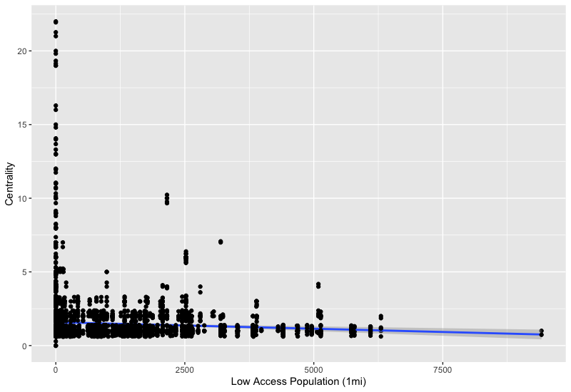

## Without Vehicle


## Without Vehicle + Low Access

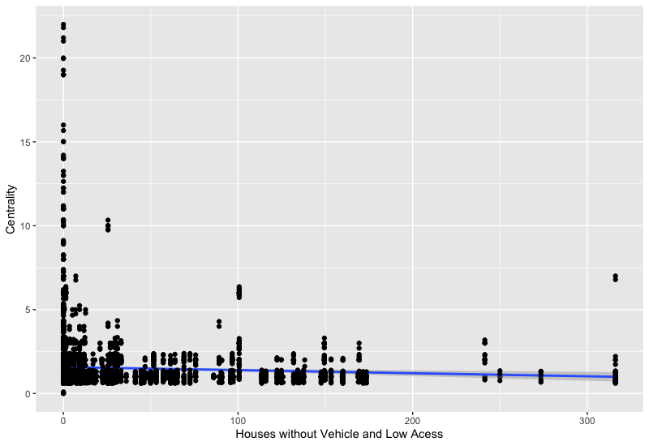

# Conclusion
- Access to transportation is not equal
  + people with lower income have lower access
  + people with low access to food have lower access to transportation
- Accordance with the article ("Long Commutes Are Awful, Especially for the Poor”)

# Discussion

1. Based on the NYT article ("I've Seen a Future Without Cars, and It's Amazing") and case of Seoul, what are your reflections?
2. What measure (e.g. Income, Food desert) would you use to evaluate the transportation system of Columbus?
3. Think about the city you are from/grew up in. What is the transportation system like there? How can it be better? What can Columbus learn from it?


# Thank you

- choi.1443@osu.edu
- https://eungangchoi.com/
