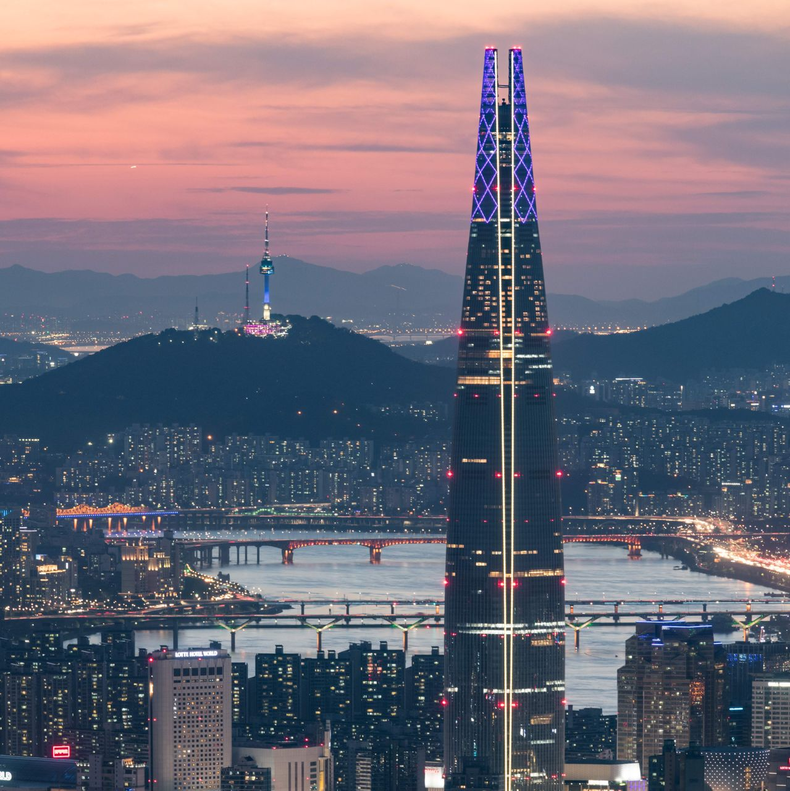

```{r setup, include=FALSE}
knitr::opts_chunk$set(echo = TRUE)
library(kableExtra)
```

# Reading


#



## Seoul, Korea
- Korean War (1950)
- Massive growth, urbanization
- Population: 10M (20% of S.Korea's population)
- Wider metropolitan area: 25M (48% of S.Korea's population)

##

[Short Video on Seoul's growth and Public Transportation](https://youtu.be/IE8g82kjKFk?t=655)

## Public Transportation in Seoul
- 2004 BRT (Bus Rapid Transit) reform
	- bus route redesigns and bus lane expansions
	- frequent network of priority bus lines
	- seamless, free transfers between bus and subway

## Result

- Bus Ridership increased by 14% (2004), and 20% (2010)
- Bus speeds doubled
- Faster travel times for cars

## More Space for People
- overpaths and elevated freeways gone
- more walk paths and nature


## Cheonggyecheon
- 3 mile stretch of elevated freeway built over a stream
- restored in 2005, uncovering nature
- less air polution
- lower temperature in nearby areas during summer
- "car-oriented city to a human-oriented city"
- number of fish species 4 -> 25
- bird species 6 -> 36
- insect species 15 -> 192

##


## 


## Seoul-ro
- elevated highway near Seoul Station
- built in 1970 to accomodate growing traffic congestion in Seoul (1970)
- Project 7017
  - turn a highway into a pedestrian walkway
  - people-friendly city
  - boost in local economy (connectivity and access to small shops)

##


## 


# Columbus, OH

##

##


## Research Questions

**What is the relationship between the bus network and spatial inequality in Columbus?**

  + Income levels
  + Low access (food deserts)
  + Race


# Data & Methods
## Bus Stop Data
Source: [Smart Columbus Data](https://smartcolumbusos.com)

COTA Bus stop data (Sept. 2018)

+ geocodes
+ bus lines passing through the stop

##


## Create Network

1. Arrange the stops by each lines
2. Connect the stops (*nodes*) in each lines (forming *ties*)
3. Calculate *Centrality*

## **Centrality**

  + Measuring the importance of a node
  + Having the most ties to other actors in the network
  + More access to other parts of the city

##
```{r, echo=FALSE}
knitr::include_url("https://www.eungangchoi.com/posts/mymap_color.html")
```

## Food Access Research Atlas Data

Source: [USDA](https://www.ers.usda.gov/data-products/food-access-research-atlas/)

+ tract-level data on food access (supermarket accessibility)
+ Low income
+ low vehicle access
+ by various demographic groups (race, age)

## Key Variables

+ **Median Family Income**: tract median family income (standardized)
+ **Low Access Vehicles**: more than 100 households without vehicles & beyond 1/2 mile from supermarket
+ **Low Access Population(%)**: Share of Low Access(1/2 mile) population in tract 
+ **Low Access Race/Ethnicity(%)**: Share of Low Access(1/2 mile) in tract population by race/ethnicity
+ WILL BE ADDING URBAN/RURAL VARIABLE

# Results
```{r, echo=FALSE}
knitr::include_url("https://www.eungangchoi.com/posts/table.html")
```
- WILL BE REPLACED WITH GRAPHS

## Results
- WILL BE MAKING CHANGES

# Conclusion
- Access to transportation is not equally provided to the people that need it most
- Accordance with the article ("Long Commutes Are Awful, Especially for the Poor”)
