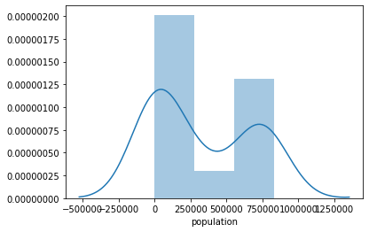
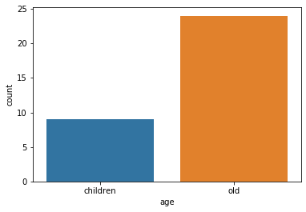
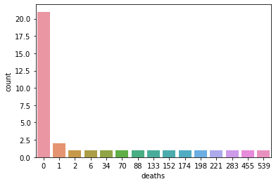
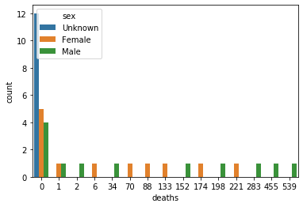
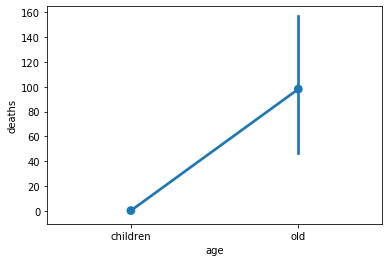
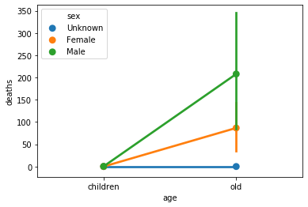

## Load packages 


```python
import pandas as pd #importing pandas package
import numpy as np #importing numpy package
```

## Read CSV


```python
data = pd.read_csv("https://data.smartcolumbusos.com/api/v1/dataset/dd66bd77-7fa2-4b57-9a21-8d1606430d5c/download?_format=csv")
```

## Exploration


```python
data.shape #shape of the whole dataframe (row, column)
```


    (36, 5)


```python
data
```


<div>
<style scoped>
    .dataframe tbody tr th:only-of-type {
        vertical-align: middle;
    }

    .dataframe tbody tr th {
        vertical-align: top;
    }

    .dataframe thead th {
        text-align: right;
    }
</style>
<table border="1" class="dataframe">
  <thead>
    <tr style="text-align: right;">
      <th></th>
      <th>age 11 categories</th>
      <th>deaths</th>
      <th>population</th>
      <th>sex</th>
      <th>sort</th>
    </tr>
  </thead>
  <tbody>
    <tr>
      <th>0</th>
      <td>55-64</td>
      <td>0</td>
      <td>0</td>
      <td>Unknown</td>
      <td>66</td>
    </tr>
    <tr>
      <th>1</th>
      <td>25-34</td>
      <td>221</td>
      <td>749931</td>
      <td>Female</td>
      <td>8</td>
    </tr>
    <tr>
      <th>2</th>
      <td>&lt; 1</td>
      <td>0</td>
      <td>70647</td>
      <td>Male</td>
      <td>26</td>
    </tr>
    <tr>
      <th>3</th>
      <td>65-74</td>
      <td>6</td>
      <td>576294</td>
      <td>Female</td>
      <td>16</td>
    </tr>
    <tr>
      <th>4</th>
      <td>Unk</td>
      <td>0</td>
      <td>0</td>
      <td>Female</td>
      <td>22</td>
    </tr>
    <tr>
      <th>5</th>
      <td>1-4</td>
      <td>0</td>
      <td>273310</td>
      <td>Female</td>
      <td>2</td>
    </tr>
    <tr>
      <th>6</th>
      <td>&lt; 1</td>
      <td>0</td>
      <td>0</td>
      <td>Unknown</td>
      <td>52</td>
    </tr>
    <tr>
      <th>7</th>
      <td>85+</td>
      <td>0</td>
      <td>0</td>
      <td>Unknown</td>
      <td>72</td>
    </tr>
    <tr>
      <th>8</th>
      <td>45-54</td>
      <td>133</td>
      <td>784260</td>
      <td>Female</td>
      <td>12</td>
    </tr>
    <tr>
      <th>9</th>
      <td>65-74</td>
      <td>34</td>
      <td>504736</td>
      <td>Male</td>
      <td>42</td>
    </tr>
    <tr>
      <th>10</th>
      <td>Unk</td>
      <td>0</td>
      <td>0</td>
      <td>Male</td>
      <td>48</td>
    </tr>
    <tr>
      <th>11</th>
      <td>75-84</td>
      <td>2</td>
      <td>233349</td>
      <td>Male</td>
      <td>44</td>
    </tr>
    <tr>
      <th>12</th>
      <td>35-44</td>
      <td>0</td>
      <td>0</td>
      <td>Unknown</td>
      <td>62</td>
    </tr>
    <tr>
      <th>13</th>
      <td>35-44</td>
      <td>455</td>
      <td>685852</td>
      <td>Male</td>
      <td>36</td>
    </tr>
    <tr>
      <th>14</th>
      <td>&lt; 1</td>
      <td>0</td>
      <td>67249</td>
      <td>Female</td>
      <td>0</td>
    </tr>
    <tr>
      <th>15</th>
      <td>65-74</td>
      <td>0</td>
      <td>0</td>
      <td>Unknown</td>
      <td>68</td>
    </tr>
    <tr>
      <th>16</th>
      <td>75-84</td>
      <td>1</td>
      <td>318103</td>
      <td>Female</td>
      <td>18</td>
    </tr>
    <tr>
      <th>17</th>
      <td>1-4</td>
      <td>1</td>
      <td>286717</td>
      <td>Male</td>
      <td>28</td>
    </tr>
    <tr>
      <th>18</th>
      <td>5-14</td>
      <td>0</td>
      <td>0</td>
      <td>Unknown</td>
      <td>56</td>
    </tr>
    <tr>
      <th>19</th>
      <td>55-64</td>
      <td>88</td>
      <td>827746</td>
      <td>Female</td>
      <td>14</td>
    </tr>
    <tr>
      <th>20</th>
      <td>25-34</td>
      <td>0</td>
      <td>0</td>
      <td>Unknown</td>
      <td>60</td>
    </tr>
    <tr>
      <th>21</th>
      <td>15-24</td>
      <td>152</td>
      <td>786133</td>
      <td>Male</td>
      <td>32</td>
    </tr>
    <tr>
      <th>22</th>
      <td>45-54</td>
      <td>0</td>
      <td>0</td>
      <td>Unknown</td>
      <td>64</td>
    </tr>
    <tr>
      <th>23</th>
      <td>35-44</td>
      <td>174</td>
      <td>694268</td>
      <td>Female</td>
      <td>10</td>
    </tr>
    <tr>
      <th>24</th>
      <td>25-34</td>
      <td>539</td>
      <td>756979</td>
      <td>Male</td>
      <td>34</td>
    </tr>
    <tr>
      <th>25</th>
      <td>75-84</td>
      <td>0</td>
      <td>0</td>
      <td>Unknown</td>
      <td>70</td>
    </tr>
    <tr>
      <th>26</th>
      <td>5-14</td>
      <td>0</td>
      <td>740345</td>
      <td>Male</td>
      <td>30</td>
    </tr>
    <tr>
      <th>27</th>
      <td>1-4</td>
      <td>0</td>
      <td>0</td>
      <td>Unknown</td>
      <td>54</td>
    </tr>
    <tr>
      <th>28</th>
      <td>45-54</td>
      <td>283</td>
      <td>763428</td>
      <td>Male</td>
      <td>38</td>
    </tr>
    <tr>
      <th>29</th>
      <td>85+</td>
      <td>0</td>
      <td>85885</td>
      <td>Male</td>
      <td>46</td>
    </tr>
    <tr>
      <th>30</th>
      <td>Unk</td>
      <td>0</td>
      <td>0</td>
      <td>Unknown</td>
      <td>74</td>
    </tr>
    <tr>
      <th>31</th>
      <td>15-24</td>
      <td>0</td>
      <td>0</td>
      <td>Unknown</td>
      <td>58</td>
    </tr>
    <tr>
      <th>32</th>
      <td>85+</td>
      <td>0</td>
      <td>168262</td>
      <td>Female</td>
      <td>20</td>
    </tr>
    <tr>
      <th>33</th>
      <td>5-14</td>
      <td>0</td>
      <td>710133</td>
      <td>Female</td>
      <td>4</td>
    </tr>
    <tr>
      <th>34</th>
      <td>15-24</td>
      <td>70</td>
      <td>753123</td>
      <td>Female</td>
      <td>6</td>
    </tr>
    <tr>
      <th>35</th>
      <td>55-64</td>
      <td>198</td>
      <td>777623</td>
      <td>Male</td>
      <td>40</td>
    </tr>
  </tbody>
</table>
</div>


```python
data.columns
```


    Index(['age 11 categories', 'deaths', 'population', 'sex', 'sort'], dtype='object')


```python
data.dtypes
```


    age 11 categories    object
    deaths                int64
    population            int64
    sex                  object
    sort                  int64
    dtype: object


```python
data.describe()
```


<div>
<style scoped>
    .dataframe tbody tr th:only-of-type {
        vertical-align: middle;
    }

    .dataframe tbody tr th {
        vertical-align: top;
    }

    .dataframe thead th {
        text-align: right;
    }
</style>
<table border="1" class="dataframe">
  <thead>
    <tr style="text-align: right;">
      <th></th>
      <th>deaths</th>
      <th>population</th>
      <th>sort</th>
    </tr>
  </thead>
  <tbody>
    <tr>
      <th>count</th>
      <td>36.000000</td>
      <td>36.000000</td>
      <td>36.00000</td>
    </tr>
    <tr>
      <th>mean</th>
      <td>65.472222</td>
      <td>322621.472222</td>
      <td>37.00000</td>
    </tr>
    <tr>
      <th>std</th>
      <td>130.523449</td>
      <td>338515.069211</td>
      <td>22.64004</td>
    </tr>
    <tr>
      <th>min</th>
      <td>0.000000</td>
      <td>0.000000</td>
      <td>0.00000</td>
    </tr>
    <tr>
      <th>25%</th>
      <td>0.000000</td>
      <td>0.000000</td>
      <td>17.50000</td>
    </tr>
    <tr>
      <th>50%</th>
      <td>0.000000</td>
      <td>200805.500000</td>
      <td>37.00000</td>
    </tr>
    <tr>
      <th>75%</th>
      <td>74.500000</td>
      <td>717686.000000</td>
      <td>56.50000</td>
    </tr>
    <tr>
      <th>max</th>
      <td>539.000000</td>
      <td>827746.000000</td>
      <td>74.00000</td>
    </tr>
  </tbody>
</table>
</div>


```python
data.head() #showing first 5
```


<div>
<style scoped>
    .dataframe tbody tr th:only-of-type {
        vertical-align: middle;
    }

    .dataframe tbody tr th {
        vertical-align: top;
    }

    .dataframe thead th {
        text-align: right;
    }
</style>
<table border="1" class="dataframe">
  <thead>
    <tr style="text-align: right;">
      <th></th>
      <th>age 11 categories</th>
      <th>deaths</th>
      <th>population</th>
      <th>sex</th>
      <th>sort</th>
    </tr>
  </thead>
  <tbody>
    <tr>
      <th>0</th>
      <td>55-64</td>
      <td>0</td>
      <td>0</td>
      <td>Unknown</td>
      <td>66</td>
    </tr>
    <tr>
      <th>1</th>
      <td>25-34</td>
      <td>221</td>
      <td>749931</td>
      <td>Female</td>
      <td>8</td>
    </tr>
    <tr>
      <th>2</th>
      <td>&lt; 1</td>
      <td>0</td>
      <td>70647</td>
      <td>Male</td>
      <td>26</td>
    </tr>
    <tr>
      <th>3</th>
      <td>65-74</td>
      <td>6</td>
      <td>576294</td>
      <td>Female</td>
      <td>16</td>
    </tr>
    <tr>
      <th>4</th>
      <td>Unk</td>
      <td>0</td>
      <td>0</td>
      <td>Female</td>
      <td>22</td>
    </tr>
  </tbody>
</table>
</div>


```python
data[:5] #showing from start to 5
```


<div>
<style scoped>
    .dataframe tbody tr th:only-of-type {
        vertical-align: middle;
    }

    .dataframe tbody tr th {
        vertical-align: top;
    }

    .dataframe thead th {
        text-align: right;
    }
</style>
<table border="1" class="dataframe">
  <thead>
    <tr style="text-align: right;">
      <th></th>
      <th>age 11 categories</th>
      <th>deaths</th>
      <th>population</th>
      <th>sex</th>
      <th>sort</th>
    </tr>
  </thead>
  <tbody>
    <tr>
      <th>0</th>
      <td>55-64</td>
      <td>0</td>
      <td>0</td>
      <td>Unknown</td>
      <td>66</td>
    </tr>
    <tr>
      <th>1</th>
      <td>25-34</td>
      <td>221</td>
      <td>749931</td>
      <td>Female</td>
      <td>8</td>
    </tr>
    <tr>
      <th>2</th>
      <td>&lt; 1</td>
      <td>0</td>
      <td>70647</td>
      <td>Male</td>
      <td>26</td>
    </tr>
    <tr>
      <th>3</th>
      <td>65-74</td>
      <td>6</td>
      <td>576294</td>
      <td>Female</td>
      <td>16</td>
    </tr>
    <tr>
      <th>4</th>
      <td>Unk</td>
      <td>0</td>
      <td>0</td>
      <td>Female</td>
      <td>22</td>
    </tr>
  </tbody>
</table>
</div>


```python
data.tail() #showing last 5
```


<div>
<style scoped>
    .dataframe tbody tr th:only-of-type {
        vertical-align: middle;
    }

    .dataframe tbody tr th {
        vertical-align: top;
    }

    .dataframe thead th {
        text-align: right;
    }
</style>
<table border="1" class="dataframe">
  <thead>
    <tr style="text-align: right;">
      <th></th>
      <th>age 11 categories</th>
      <th>deaths</th>
      <th>population</th>
      <th>sex</th>
      <th>sort</th>
    </tr>
  </thead>
  <tbody>
    <tr>
      <th>31</th>
      <td>15-24</td>
      <td>0</td>
      <td>0</td>
      <td>Unknown</td>
      <td>58</td>
    </tr>
    <tr>
      <th>32</th>
      <td>85+</td>
      <td>0</td>
      <td>168262</td>
      <td>Female</td>
      <td>20</td>
    </tr>
    <tr>
      <th>33</th>
      <td>5-14</td>
      <td>0</td>
      <td>710133</td>
      <td>Female</td>
      <td>4</td>
    </tr>
    <tr>
      <th>34</th>
      <td>15-24</td>
      <td>70</td>
      <td>753123</td>
      <td>Female</td>
      <td>6</td>
    </tr>
    <tr>
      <th>35</th>
      <td>55-64</td>
      <td>198</td>
      <td>777623</td>
      <td>Male</td>
      <td>40</td>
    </tr>
  </tbody>
</table>
</div>


```python
data[-5:] #showing from last 5 to the end
```


<div>
<style scoped>
    .dataframe tbody tr th:only-of-type {
        vertical-align: middle;
    }

    .dataframe tbody tr th {
        vertical-align: top;
    }

    .dataframe thead th {
        text-align: right;
    }
</style>
<table border="1" class="dataframe">
  <thead>
    <tr style="text-align: right;">
      <th></th>
      <th>age 11 categories</th>
      <th>deaths</th>
      <th>population</th>
      <th>sex</th>
      <th>sort</th>
    </tr>
  </thead>
  <tbody>
    <tr>
      <th>31</th>
      <td>15-24</td>
      <td>0</td>
      <td>0</td>
      <td>Unknown</td>
      <td>58</td>
    </tr>
    <tr>
      <th>32</th>
      <td>85+</td>
      <td>0</td>
      <td>168262</td>
      <td>Female</td>
      <td>20</td>
    </tr>
    <tr>
      <th>33</th>
      <td>5-14</td>
      <td>0</td>
      <td>710133</td>
      <td>Female</td>
      <td>4</td>
    </tr>
    <tr>
      <th>34</th>
      <td>15-24</td>
      <td>70</td>
      <td>753123</td>
      <td>Female</td>
      <td>6</td>
    </tr>
    <tr>
      <th>35</th>
      <td>55-64</td>
      <td>198</td>
      <td>777623</td>
      <td>Male</td>
      <td>40</td>
    </tr>
  </tbody>
</table>
</div>


```python
data.loc[12] #loc is as way to identify information on the 4th row in the data
```


    age 11 categories      35-44
    deaths                     0
    population                 0
    sex                  Unknown
    sort                      62
    Name: 12, dtype: object


```python
data.loc[12, 'deaths'] # what is the value for 'deaths' in the 4th row
```


    0


### What is the population size of the 5th observation?

# Let's look at sex


```python
data["sex"].unique()
```


    array(['Unknown', 'Female', 'Male'], dtype=object)


```python
data['sex'].value_counts()
```


    Unknown    12
    Male       12
    Female     12
    Name: sex, dtype: int64


```python
encode_sex = pd.get_dummies(data["sex"], prefix="encode") #get_dummies does this automatically, prefix comes before each new column name
```


```python
data = pd.concat([data, encode_sex], axis = 1) #concat concatenates the columns, axis 1 is horizontal, axis 0 is vertical concatenation
```


```python
data.head()
```


<div>
<style scoped>
    .dataframe tbody tr th:only-of-type {
        vertical-align: middle;
    }

    .dataframe tbody tr th {
        vertical-align: top;
    }

    .dataframe thead th {
        text-align: right;
    }
</style>
<table border="1" class="dataframe">
  <thead>
    <tr style="text-align: right;">
      <th></th>
      <th>age 11 categories</th>
      <th>deaths</th>
      <th>population</th>
      <th>sex</th>
      <th>sort</th>
      <th>encode_Female</th>
      <th>encode_Male</th>
      <th>encode_Unknown</th>
    </tr>
  </thead>
  <tbody>
    <tr>
      <th>0</th>
      <td>55-64</td>
      <td>0</td>
      <td>0</td>
      <td>Unknown</td>
      <td>66</td>
      <td>0</td>
      <td>0</td>
      <td>1</td>
    </tr>
    <tr>
      <th>1</th>
      <td>25-34</td>
      <td>221</td>
      <td>749931</td>
      <td>Female</td>
      <td>8</td>
      <td>1</td>
      <td>0</td>
      <td>0</td>
    </tr>
    <tr>
      <th>2</th>
      <td>&lt; 1</td>
      <td>0</td>
      <td>70647</td>
      <td>Male</td>
      <td>26</td>
      <td>0</td>
      <td>1</td>
      <td>0</td>
    </tr>
    <tr>
      <th>3</th>
      <td>65-74</td>
      <td>6</td>
      <td>576294</td>
      <td>Female</td>
      <td>16</td>
      <td>1</td>
      <td>0</td>
      <td>0</td>
    </tr>
    <tr>
      <th>4</th>
      <td>Unk</td>
      <td>0</td>
      <td>0</td>
      <td>Female</td>
      <td>22</td>
      <td>1</td>
      <td>0</td>
      <td>0</td>
    </tr>
  </tbody>
</table>
</div>


```python
data.loc[data['sex']=="Unknown", "Missing"] = "yes"
data.loc[data['sex']!="Unknown", "Missing"] = "no"

```


```python
data.head()
```


<div>
<style scoped>
    .dataframe tbody tr th:only-of-type {
        vertical-align: middle;
    }

    .dataframe tbody tr th {
        vertical-align: top;
    }

    .dataframe thead th {
        text-align: right;
    }
</style>
<table border="1" class="dataframe">
  <thead>
    <tr style="text-align: right;">
      <th></th>
      <th>age 11 categories</th>
      <th>deaths</th>
      <th>population</th>
      <th>sex</th>
      <th>sort</th>
      <th>encode_Female</th>
      <th>encode_Male</th>
      <th>encode_Unknown</th>
      <th>Missing</th>
    </tr>
  </thead>
  <tbody>
    <tr>
      <th>0</th>
      <td>55-64</td>
      <td>0</td>
      <td>0</td>
      <td>Unknown</td>
      <td>66</td>
      <td>0</td>
      <td>0</td>
      <td>1</td>
      <td>yes</td>
    </tr>
    <tr>
      <th>1</th>
      <td>25-34</td>
      <td>221</td>
      <td>749931</td>
      <td>Female</td>
      <td>8</td>
      <td>1</td>
      <td>0</td>
      <td>0</td>
      <td>no</td>
    </tr>
    <tr>
      <th>2</th>
      <td>&lt; 1</td>
      <td>0</td>
      <td>70647</td>
      <td>Male</td>
      <td>26</td>
      <td>0</td>
      <td>1</td>
      <td>0</td>
      <td>no</td>
    </tr>
    <tr>
      <th>3</th>
      <td>65-74</td>
      <td>6</td>
      <td>576294</td>
      <td>Female</td>
      <td>16</td>
      <td>1</td>
      <td>0</td>
      <td>0</td>
      <td>no</td>
    </tr>
    <tr>
      <th>4</th>
      <td>Unk</td>
      <td>0</td>
      <td>0</td>
      <td>Female</td>
      <td>22</td>
      <td>1</td>
      <td>0</td>
      <td>0</td>
      <td>no</td>
    </tr>
  </tbody>
</table>
</div>


## Clean Age


```python
data.loc[(data['age 11 categories'] == "< 1") | (data['age 11 categories'] == "1-4") | (data['age 11 categories'] == "5-14"), "age"] = "children"
```


```python
otherAge = ('15-24', '25-34', '35-44', '45-54', '55-64', '65-74', '75-84', '85+')
data.loc[data['age 11 categories'].isin(otherAge), "age"] = "old"
```


```python
data[['age', 'age 11 categories']]
```


<div>
<style scoped>
    .dataframe tbody tr th:only-of-type {
        vertical-align: middle;
    }

    .dataframe tbody tr th {
        vertical-align: top;
    }

    .dataframe thead th {
        text-align: right;
    }
</style>
<table border="1" class="dataframe">
  <thead>
    <tr style="text-align: right;">
      <th></th>
      <th>age</th>
      <th>age 11 categories</th>
    </tr>
  </thead>
  <tbody>
    <tr>
      <th>0</th>
      <td>old</td>
      <td>55-64</td>
    </tr>
    <tr>
      <th>1</th>
      <td>old</td>
      <td>25-34</td>
    </tr>
    <tr>
      <th>2</th>
      <td>children</td>
      <td>&lt; 1</td>
    </tr>
    <tr>
      <th>3</th>
      <td>old</td>
      <td>65-74</td>
    </tr>
    <tr>
      <th>4</th>
      <td>NaN</td>
      <td>Unk</td>
    </tr>
    <tr>
      <th>5</th>
      <td>children</td>
      <td>1-4</td>
    </tr>
    <tr>
      <th>6</th>
      <td>children</td>
      <td>&lt; 1</td>
    </tr>
    <tr>
      <th>7</th>
      <td>old</td>
      <td>85+</td>
    </tr>
    <tr>
      <th>8</th>
      <td>old</td>
      <td>45-54</td>
    </tr>
    <tr>
      <th>9</th>
      <td>old</td>
      <td>65-74</td>
    </tr>
    <tr>
      <th>10</th>
      <td>NaN</td>
      <td>Unk</td>
    </tr>
    <tr>
      <th>11</th>
      <td>old</td>
      <td>75-84</td>
    </tr>
    <tr>
      <th>12</th>
      <td>old</td>
      <td>35-44</td>
    </tr>
    <tr>
      <th>13</th>
      <td>old</td>
      <td>35-44</td>
    </tr>
    <tr>
      <th>14</th>
      <td>children</td>
      <td>&lt; 1</td>
    </tr>
    <tr>
      <th>15</th>
      <td>old</td>
      <td>65-74</td>
    </tr>
    <tr>
      <th>16</th>
      <td>old</td>
      <td>75-84</td>
    </tr>
    <tr>
      <th>17</th>
      <td>children</td>
      <td>1-4</td>
    </tr>
    <tr>
      <th>18</th>
      <td>children</td>
      <td>5-14</td>
    </tr>
    <tr>
      <th>19</th>
      <td>old</td>
      <td>55-64</td>
    </tr>
    <tr>
      <th>20</th>
      <td>old</td>
      <td>25-34</td>
    </tr>
    <tr>
      <th>21</th>
      <td>old</td>
      <td>15-24</td>
    </tr>
    <tr>
      <th>22</th>
      <td>old</td>
      <td>45-54</td>
    </tr>
    <tr>
      <th>23</th>
      <td>old</td>
      <td>35-44</td>
    </tr>
    <tr>
      <th>24</th>
      <td>old</td>
      <td>25-34</td>
    </tr>
    <tr>
      <th>25</th>
      <td>old</td>
      <td>75-84</td>
    </tr>
    <tr>
      <th>26</th>
      <td>children</td>
      <td>5-14</td>
    </tr>
    <tr>
      <th>27</th>
      <td>children</td>
      <td>1-4</td>
    </tr>
    <tr>
      <th>28</th>
      <td>old</td>
      <td>45-54</td>
    </tr>
    <tr>
      <th>29</th>
      <td>old</td>
      <td>85+</td>
    </tr>
    <tr>
      <th>30</th>
      <td>NaN</td>
      <td>Unk</td>
    </tr>
    <tr>
      <th>31</th>
      <td>old</td>
      <td>15-24</td>
    </tr>
    <tr>
      <th>32</th>
      <td>old</td>
      <td>85+</td>
    </tr>
    <tr>
      <th>33</th>
      <td>children</td>
      <td>5-14</td>
    </tr>
    <tr>
      <th>34</th>
      <td>old</td>
      <td>15-24</td>
    </tr>
    <tr>
      <th>35</th>
      <td>old</td>
      <td>55-64</td>
    </tr>
  </tbody>
</table>
</div>


## Excercise
- Create a new variable called "big_population" for population larger than the 75% percentile
- use "value_counts()" to get a frequency table of "big_population"
- create new variable called "age_groups" with three values: "child", "adolescent", and "adult"
- make a crosstab of "age 11 categories" and "age_groups" to check

## Crosstabs


```python
data['deaths'].describe() #describe gives descriptive statistics
```


    count     36.000000
    mean      65.472222
    std      130.523449
    min        0.000000
    25%        0.000000
    50%        0.000000
    75%       74.500000
    max      539.000000
    Name: deaths, dtype: float64


```python
pd.crosstab(data['age'], data['sex'])
```


<div>
<style scoped>
    .dataframe tbody tr th:only-of-type {
        vertical-align: middle;
    }

    .dataframe tbody tr th {
        vertical-align: top;
    }

    .dataframe thead th {
        text-align: right;
    }
</style>
<table border="1" class="dataframe">
  <thead>
    <tr style="text-align: right;">
      <th>sex</th>
      <th>Female</th>
      <th>Male</th>
      <th>Unknown</th>
    </tr>
    <tr>
      <th>age</th>
      <th></th>
      <th></th>
      <th></th>
    </tr>
  </thead>
  <tbody>
    <tr>
      <th>children</th>
      <td>3</td>
      <td>3</td>
      <td>3</td>
    </tr>
    <tr>
      <th>old</th>
      <td>8</td>
      <td>8</td>
      <td>8</td>
    </tr>
  </tbody>
</table>
</div>


## Visualization


```python
import seaborn as sns # importing package 'seaborn'
import matplotlib.pyplot as plt # importing package matplotlib.pyplot
%matplotlib inline  
#to show graph in notebook
```


```python
sns.distplot(data["population"], bins=3) #plot a distribution plot for population
```


    <matplotlib.axes._subplots.AxesSubplot at 0x1a1ef03f60>





```python
sns.countplot(data=data, x="age", order=("children", "old")) #plot countplot for dayofweek
```


    <matplotlib.axes._subplots.AxesSubplot at 0x1a1efc2b38>





```python
sns.countplot(data=data, x="deaths")
```


    <matplotlib.axes._subplots.AxesSubplot at 0x1a1f0be048>





```python
sns.countplot(data=data, x="deaths", hue='sex')
```


    <matplotlib.axes._subplots.AxesSubplot at 0x1a1f1a1320>





```python
sns.pointplot(data=data, x="age", y="deaths", order=("children", "old"))
```


    <matplotlib.axes._subplots.AxesSubplot at 0x1a1f1ee550>





```python
sns.pointplot(data=data, x="age", y="deaths", hue ="sex", order=("children", "old"))
```


    <matplotlib.axes._subplots.AxesSubplot at 0x1a21450208>





## Excercise
- create different plots with "age_groups"

## Out to CSV


```python
data.columns #look at all column names
```


    Index(['age 11 categories', 'deaths', 'population', 'sex', 'sort',
           'encode_Female', 'encode_Male', 'encode_Unknown', 'Missing', 'age'],
          dtype='object')


```python
data.to_csv("output.csv") #export out to csv file
```
